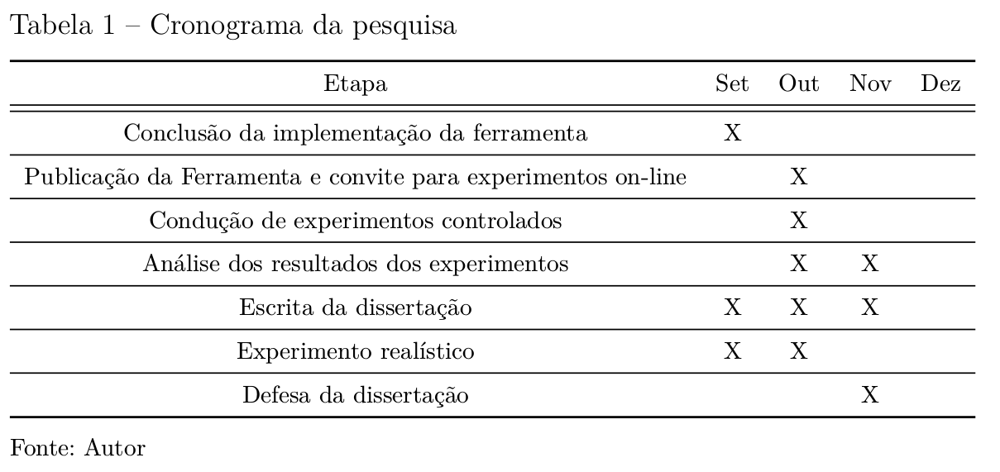

% Linguagem de marcação de texto para produção de trabalhos acadêmicos
% Eduardo de Santana Medeiros Alexandre
% 2016

# Introdução

- Monografia como requisito para conclusão de curso.
- Sofrimentos dos alunos associados a formatação e aplicação das Normas da ABNT

# Softwares de edição: Editores de texto rico VS Latex

- **Editores de texto rico**: exige conhecimento de recursos
avançados, tais como utilização de estilos, geração de sumário e
gerência de referências;
- **Latex**: curva de aprendizado maior.

# Problemas em editores de texto rico

Problemas de casos reais de alunos utilizando o MS Word para edição do
trabalho de conclusão do curso.

# Problemas em editores de texto rico

- Seções sem numeração;
- Sem utilização de estilos;
- Espaçamento não uniforme;
- Geração manual do sumário.

# Problemas em editores de texto rico

- Controle manual de quebra de páginas.

# Problemas em editores de texto rico

- Sumário editado manualmente

# Problemas em editores de texto rico

- Modelo disponibilizado por uma IES (2015) utilizando posicionamento
  do título do quadro na posição errada.

# Latex: um pouco prolixo

Código para inserir uma lista não numerada no Latex:

    \begin{itemize}
      \item item1
      \item item2
    \end{itemize}
	
O equivalente em *linguagens de marcação de texto*:

    - item1
    - item2

# Motivação

Ofertar uma *nova* alternativa para elaboração de trabalhos acadêmicos
(monografia, dissertação ou tese) utilizando uma linguagem de marcação
de texto, elaborada com o propósito de produzir trabalhos em
conformidade com as Normas da ABNT.

# Objetivo Geral

Esse trabalho objetiva *propor* e *avaliar* um sistema que utiliza
uma linguagem de marcação de texto especializada para a produção de
trabalhos acadêmicos em conformidades com as normas da ABNT.

# Objetivos Específicos

- Implementar um sistema com utilização de uma linguagem de marcação
  de texto na produção de trabalhos acadêmicos;
  
- Avaliar a usabilidade da linguagem através de experimentos de
  elaboração de trabalhos acadêmicos em contextos realístico e não
  realístico.

# Método

- Utilização do *framework* de Dimensões Cognitivas de Notações.
- Condução de experimentos

# Fundamentação teórica

# Normas da ABNT para trabalhos acadêmicos 

- Documento não disponibilizado gratuitamente -- gera desconhecimento das normas;
- Muitas regras

# abnTeX2

- Auxilia a produção de materiais em conformidade com as Normas da ABNT no Latex;
- Contribui para a popularização do Latex.

# Markdown

- Linguagem de marcação de texto que teve sua origem na produção de textos para WEB.
- O visual do texto deve ser equivalente ao visual do texto produzido.

# Markdown - Pandoc

A pandoc é uma ferramenta que implementa o Markdown

- Conversor universal (auto proclamação)
- Utiliza configuração de estilos para conversão.

# Asciidoc

Linguagem de marcação de texto originada para produção de *livros técnicos*.

- Exige que o usário conheça uma sintaxe maior de símbolos, os
significados e grafias de alguns termos em inglês (tais como: 
*image, table, witdh, footnote e preface*).

# ABNTFÁCIL: formatação de trabalhos acadêmicos

Uma solução de software comercial para produção de textos acadêmicos
com uma linguagem de marcação própria e utilização de formulários para
configuração de diversos aspectos.

# Sistema = Notação + Ambiente

- Desenvolvimento de ambiente de programação em pascal através da voz
- Erro de compilação do *Gererics* em Java

# Framework de Dimensões Cognitivas de Notações

1. A visocidade (*Viscosity*) está relacionada a resistência a
mudanças;

2. A Visibilidade (*Visibility*) é a habilidade de ver componentes
facilmente;

3. O compromisso prematuro (*Premature commitment*) consiste em impor
restrições na ordem de realizar as ações;

4. As Dependências ocultas (*Hidden dependencies*) consistem em propagar
as alterações para outras entidades;

5. Expressividade de papeis (*Role-expressiveness*) consiste em como as
entidades são facilmente inferidas ao observá-las;

6. A Tendência a erros (*Error-proneness*) é quanto a notação facilita o
usuário a errar \cite{blackwell2003notational};

7. Abstrações (*Abstraction*) são tipos ou disponibilidade de
mecanismos de abstrações. Exemplos de abstrações são controles de
*playback*;

8. Notação secundária (*Secondary notation*) consiste em informações
extras apresentadas ao usuário com sintaxe diferente da formal.

9. Proximidade do mapeamento (*Closeness of mapping*) refere-se a uma
correlação entre a interface e a tarefa sendo realizada ou seu
resultado experado;

10. A Consistência (*Consistency*) referê-se a como informações similares
possuem semântica semelhante;

11. Prolixidade (*Diffuseness*) refere-se a verbosidade da linguagem. A
notação permite que o usuário realize o que deseja de forma breve ou
requer tediosas intervenções?;

12. A Exploração (*Provisionality*) refere-se ao grau de liberdade para
testar ou explorar novas ideias;

13. A Avaliação progressiva (*Progressive evaluation*) refere-se a
habilidade de checar o resultado a qualquer dado momento.

# Trabalhos relacionados

## R Markdown: linguagem para reprodutibilidade de pesquisas científicas

- Variação da linguagem Markdown com o propósito de facilitar a 
*reprodutibilidade* de pesquisas científicas.

- Utiliza o código R para cálculos estatísticos.

## Análise de interfaces de softwares para composição de músicas e efeitos sonoros

## Análise de usabilidade de ambientes de programação visual

- Utilização do *framework*

## Avaliação da usabilidade através de usuários que não conhecem o *framework*

- Utilização do Questionário com usuários -- elaborado com base no *framework*

# Proposta de dissertação

-   Elaboração da ferramenta Limarka para implementar a linguagem;

-   Configuração de modelo Latex, baseados no abnTeX2, e parametrizado
    para utilização com a ferramenta Pandoc para geração de trabalhos
    acadêmicos (monografias, dissertação e tese) com a formatação
    segundo as regras da ABNT;

-   Elaboração e **utilização de formulário PDF** para obter configurações
    do usuário;

-   Avaliação de usabilidade utilizando o *framework* de Dimensões
    Cognitivas: (1) baseada na utilização de um caso real (escrita
    dessa dissertação), (2) experimentos com aplicação do questionário
    com contextos não realísticos e (3) aplicação de questionários em
    ambiente não controlado com usuários da ferramenta na WEB.

# Status de implementação da ferramenta Limarka

- Lançamento da versão 0.3 até o final da semana: estável e utilizável. 

- Versão 0.4 funcionalidades para aumentar a usabilidade, final do mês.

- Dependência *pdf-forms* que dificultava a publicação foi atualizada.

# Cronograma

